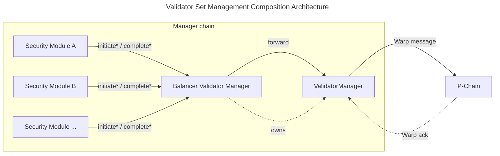

| ACP              | 280                                                                                                    |
| :--------------- | :----------------------------------------------------------------------------------------------------- |
| **Title**        | Validator Set Management Composition Standard                                                          |
| **Author(s)**    | Gonzalo Etse ([@gonzaloetjo](https://github.com/gonzaloetjo)), Suzaku team ([@suzaku-network](https://github.com/suzaku-network)) |
| **Status**       | Proposed                                                                                               |
| **Track**        | Best Practices                                                                                         |
| **Dependencies** | [ACP-77](../77-reinventing-subnets/README.md), [ACP-99](../99-validatorsetmanager-contract/README.md)  |

## Abstract

This ACP standardizes a composition layer that allows multiple security modules to share one [ACP-99](../99-validatorsetmanager-contract/README.md) `ValidatorManager`, each governing its own partition of validators.

Today, a single security module (e.g., a `PoAManager` or `StakingManager`) owns the `ValidatorManager` and defines who can join the validator set and under what conditions. This ACP defines two interfaces, `IBalancerValidatorManager` and `ISecurityModule`, and a set of behavioral rules that govern how they interact. The balancer owns the `ValidatorManager` contract and delegates validator lifecycle operations to registered security modules. Each module can implement any security model (permissioned, proof-of-stake, restaking, custom slashing logic, or models not yet conceived), while `ISecurityModule` standardizes the minimal surface every module must expose to integrate with a compliant balancer.

Together, these interfaces enable independently developed security modules to coexist over one `ValidatorManager` with per-module weight caps, module-exclusive validator assignment, and gradual transition between security models.

## Motivation

Every Avalanche L1 has different security requirements, and those requirements change as the network matures. The current standard forces L1 operators to choose a single security model for their entire validator set, with no standard way to integrate security modules through a common interface, run multiple security models in parallel, or transition between them gradually. The ecosystem has the building blocks for more flexible validator management, but lacks a standard composition layer to connect them.

- **ACP-99's open promise:** [ACP-99](../99-validatorsetmanager-contract/README.md) standardizes a `ValidatorManager` that handles the validator set lifecycle. Its multi-contract design example anticipates that one or more security modules will interact with the `ValidatorManager`. However, it specifies the initiation functions as internal and explicitly leaves the specification of those security modules and their integration interface out of scope.

- **Lack of a standard integration surface:** Ava Labs' [icm-services](https://github.com/ava-labs/icm-services/tree/validator-manager-v2.1.0/contracts/validator-manager) fills part of this gap with security modules such as `PoAManager` for permissioned operation and `StakingManager` variants for proof-of-stake. These security modules expose implementation-specific integration surfaces (`IValidatorManager`, `IValidatorManagerExternalOwnable`) that are not part of any ACP. Without a standard surface, third-party teams building their own security modules have no common interface to target, making it difficult to build portable modules or shared tooling across the ecosystem.

- **PoA-to-PoS transition risk:** Today, an L1 that launches with a permissioned validator set (PoA) and later transitions to permissionless staking faces a hard transition: existing contracts force a binary choice between PoA and PoS, and the transition window exposes the L1 to attacks where permissionless actors can remove PoA validators before sufficient economic security has been established (see [ava-labs/icm-services#1087](https://github.com/ava-labs/icm-services/issues/1087)). Since an L1 has one validator set on the P-Chain managed by one `ValidatorManager`, a staged rollout where both models run simultaneously requires a composition layer. Without one, L1s must either write a custom wrapper or accept that all validators share a single security model. With a composition layer, an L1 can start a permissionless module with a small share of the total validator weight and gradually increase it as economic security grows, phasing out the PoA module at the operator's own pace.

- **Specialized configurations:** A composition layer also enables partitioning a validator set between different security models: for example, a compliance-gated module for institutional or jurisdiction-restricted validators alongside a permissionless module for community validators, a dual-staking module that requires operators to stake both a native token and a secondary asset, or separate modules with independent staking logic for different collateral types.

This ACP standardizes such a composition layer (the "Balancer Validator Manager") that wraps a `ValidatorManager` and defines both the integration interfaces and the behavioral rules required for modules to compose safely over one `ValidatorManager`. By standardizing this surface, the ACP reduces implementation-specific coupling for security modules, whether they originate from Ava Labs' `icm-services`, third-party implementations, or custom builds.

## Specification

This standard defines:

- A balancer contract that coordinates multiple security modules over a single `ValidatorManager`
- The interfaces used between balancers and security modules
- The behavioral rules a compliant balancer must enforce so that independently developed security modules can interoperate safely over a shared `ValidatorManager`

> **Terminology:** This ACP uses `ValidatorManager` to refer to the deployed implementation of `ACP99Manager` (the concrete instance the balancer owns and delegates to). `IACP99Manager` refers to the Solidity interface for ACP-99's `ACP99Manager`. `PendingAdded` refers to the ACP-99 `ValidatorStatus` value assigned to a validator whose registration has been initiated but not yet completed on the P-Chain.



**Initiate flow:** A security module calls an `initiate*` function on the balancer, which forwards to the `ValidatorManager`, which sends a Warp message to the P-Chain.

**Complete flow:** After the P-Chain acknowledges the operation (via a Warp message back to the `ValidatorManager`), anyone can call `complete*` on the security module, which forwards through the balancer to the `ValidatorManager` to finalize the state change. (ACP-99's multi-contract example routes completion calls directly to the manager; this ACP routes them through the security module so the balancer can verify module assignment before forwarding.)

The Balancer Validator Manager is the sole `owner` of the underlying `ValidatorManager`. This centralized ownership is required so that a single contract can enforce per-module weight caps and prevent cross-module interference. Security modules interact with the validator set exclusively through the balancer: initiate operations are gated by module assignment, and complete operations verify that the calling module is assigned to the validator being finalized.

The exact ordering of these checks relative to the underlying `ValidatorManager` call is left to the implementer, provided all invariants hold within the same transaction.

`initializeValidatorSet` is delegated to the underlying `ValidatorManager`. This ACP does not standardize module assignment for the initial validator set. A compliant deployment must either:

1. wrap an already-initialized `ValidatorManager` and assign all existing validators to modules during balancer initialization, or
2. provide an implementation-specific initialization that atomically assigns every initial validator to a security module before any module-mediated operation is allowed.

Initialization is intentionally left implementation-specific because it is a one-time deployment concern; the interoperability surface for security modules is the ongoing `IBalancerValidatorManager` and `ISecurityModule` interfaces.

### `IBalancerValidatorManager`

The interface extends `IACP99Manager` and declares the `initiate*` functions as `external`; ACP-99 specifies these as `internal`, and this ACP standardizes their external form for the delegation pattern.

The balancer delegates ACP-99 lifecycle functions to the owned `ValidatorManager` and re-exposes them through `IBalancerValidatorManager`:

- The resend functions for registration and removal originate from `icm-services`' `IValidatorManager` implementation and are included here because the delegation pattern requires them on the balancer surface.
- Auxiliary query functions such as node-to-validation lookup are not standardized; security modules that require such lookups must treat them as implementation-specific extensions.
- The interface extends `IACP99Manager` rather than `IValidatorManager`, which is an Ava Labs' `icm-services` implementation detail that adds functions outside the composition surface (`migrateFromV1`, `getNodeValidationID`, `getChurnPeriodSeconds`).

`PChainOwner` is defined in ACP-99 (originating from ACP-77) and included in `IACP99Manager`.

```solidity
interface IBalancerValidatorManager is IACP99Manager {
    // ── Events ──

    /// @notice Emitted when a security module is registered, updated, or removed.
    /// @param securityModule The address of the security module.
    /// @param maxWeight The maximum total weight for validators managed by this module.
    ///                  A value of 0 indicates module removal.
    event SetUpSecurityModule(address indexed securityModule, uint64 maxWeight);

    /// @notice Emitted when a security module's current weight changes.
    /// @param securityModule The address of the security module.
    /// @param oldWeight The previous weight.
    /// @param newWeight The new weight.
    /// @param maxWeight The module's maximum weight allocation.
    event SecurityModuleWeightUpdated(
        address indexed securityModule,
        uint64 oldWeight,
        uint64 newWeight,
        uint64 maxWeight
    );

    // ── ACP-99 lifecycle (re-exposed as external) ──

    /// @notice Initiates a validator registration, sending a Warp message to the P-Chain.
    /// @param nodeID The node ID of the validator.
    /// @param blsPublicKey The BLS public key of the validator.
    /// @param remainingBalanceOwner The P-Chain owner for the remaining balance.
    /// @param disableOwner The P-Chain owner that can disable the validator.
    /// @param weight The weight of the validator being registered.
    /// @return validationID The ID of the validator registration.
    function initiateValidatorRegistration(
        bytes memory nodeID,
        bytes memory blsPublicKey,
        PChainOwner memory remainingBalanceOwner,
        PChainOwner memory disableOwner,
        uint64 weight
    ) external returns (bytes32 validationID);

    /// @notice Initiates validator removal, sending a Warp message to the P-Chain.
    /// @param validationID The ID of the validation period being ended.
    function initiateValidatorRemoval(
        bytes32 validationID
    ) external;

    /// @notice Initiates a validator weight update, sending a Warp message to the P-Chain.
    /// @param validationID The ID of the validation period being updated.
    /// @param newWeight The new weight to set for the validator.
    /// @return nonce The nonce of the weight update message.
    /// @return messageID The ID of the weight update message.
    function initiateValidatorWeightUpdate(
        bytes32 validationID,
        uint64 newWeight
    ) external returns (uint64 nonce, bytes32 messageID);

    // ── Re-exposed from icm-services ValidatorManager ──

    /// @notice Resends a validator registration message to the P-Chain.
    /// @param validationID The ID of the validation period being registered.
    function resendRegisterValidatorMessage(
        bytes32 validationID
    ) external;

    /// @notice Resends a validator removal message to the P-Chain.
    /// @param validationID The ID of the validation period being ended.
    function resendValidatorRemovalMessage(
        bytes32 validationID
    ) external;

    // ── Balancer-specific ──

    /// @notice Registers a new security module or updates an existing module's max weight.
    ///         Setting maxWeight to 0 removes the module.
    /// @param securityModule The address of the security module.
    /// @param maxWeight The maximum total weight allowed for this module's validators.
    function setUpSecurityModule(address securityModule, uint64 maxWeight) external;

    /// @notice Returns the list of registered security module addresses.
    function getSecurityModules() external view returns (address[] memory);

    /// @notice Returns the current and maximum weight for a security module.
    /// @param securityModule The address of the security module.
    /// @return weight The module's current total validator weight.
    /// @return maxWeight The module's maximum allowed weight.
    function getSecurityModuleWeights(
        address securityModule
    ) external view returns (uint64 weight, uint64 maxWeight);

    /// @notice Returns the security module assigned to a validator.
    /// @param validationID The validation ID.
    /// @return The assigned module's address, or address(0) if unassigned.
    function getValidatorSecurityModule(
        bytes32 validationID
    ) external view returns (address);

    /// @notice Returns whether a validator has an in-flight weight update.
    /// @param validationID The validation ID.
    function isValidatorPendingWeightUpdate(
        bytes32 validationID
    ) external view returns (bool);

    /// @notice Resends a pending validator weight update message to the P-Chain.
    /// @param validationID The ID of the validation period being updated.
    function resendValidatorWeightUpdate(
        bytes32 validationID
    ) external;
}
```

The `initiate*` and resend functions are declared directly in `IBalancerValidatorManager`; the `complete*` functions and view functions (`getValidator`, `l1TotalWeight`, `subnetID`) are inherited from `IACP99Manager`.

`IBalancerValidatorManager` declares two module-specific events: `SetUpSecurityModule` (emitted on module registration, update, or removal) and `SecurityModuleWeightUpdated` (emitted when a module's current weight changes). All validator lifecycle events are emitted by the underlying `ValidatorManager` during delegation and are not re-declared.

### `ISecurityModule`

We propose the following interface that security modules implement to plug into a compliant balancer:

```solidity
interface ISecurityModule {
    /// @notice Completes a validator registration after P-Chain acknowledgment.
    /// @param messageIndex The index of the Warp message carrying the registration result.
    /// @return validationID The ID of the acknowledged validation period.
    function completeValidatorRegistration(
        uint32 messageIndex
    ) external returns (bytes32 validationID);

    /// @notice Completes a validator removal after P-Chain acknowledgment.
    /// @param messageIndex The index of the Warp message carrying the removal result.
    /// @return validationID The ID of the acknowledged validation period.
    function completeValidatorRemoval(
        uint32 messageIndex
    ) external returns (bytes32 validationID);

    /// @notice Completes a validator weight update after P-Chain acknowledgment.
    /// @param messageIndex The index of the Warp message carrying the weight update acknowledgment.
    /// @return validationID The ID of the validation period.
    /// @return nonce The acknowledged validator message nonce.
    function completeValidatorWeightUpdate(
        uint32 messageIndex
    ) external returns (bytes32 validationID, uint64 nonce);
}
```

Every security module must implement `ISecurityModule`. Together with `IBalancerValidatorManager`, these interfaces define the bidirectional module-balancer integration surface: `ISecurityModule` standardizes what a module exposes (completion), `IBalancerValidatorManager` standardizes what a module calls (initiation and resend).

`ISecurityModule` only defines completion functions because initiation logic varies by security model (e.g., `onlyOwner` for PoA, stake deposit logic for PoS). This ACP does not standardize the module's own initiation policy or access-control model. The completion functions are permissionless so any caller (keepers, governance contracts, etc.) can finalize state after P-Chain acknowledgment, keeping the system moving regardless of the module's access control model.

Only registered security modules (modules with `maxWeight > 0`) may call module-gated functions on the balancer. Each completion function must forward the call to the balancer, which in turn forwards to the underlying `ValidatorManager`. The security module must be the `msg.sender` to the balancer so the balancer can verify which module is calling.

### Balancer Behavioral Rules

These rules are normative for compliant balancers and are part of the interoperability surface. Implementations of `IBalancerValidatorManager` must satisfy:

#### Weight Accounting and Caps

The balancer must track each module's current weight and enforce that the sum of all modules' current weights equals the `ValidatorManager`'s `l1TotalWeight()` after each state-changing operation completes. Per-module weight changes take effect at initiation time, mirroring the underlying `ValidatorManager`'s accounting:

| Operation | Per-module weight change |
|-----------|------------------------|
| `initiateValidatorRegistration` | module weight **+= validator weight** |
| `initiateValidatorRemoval` | module weight **-= validator weight** |
| `initiateValidatorWeightUpdate` | module weight **+= (newWeight - oldWeight)** |
| `completeValidatorRegistration` | no per-module weight change |
| `completeValidatorRemoval` (active/removed validator) | no per-module weight change (weight was already deducted at initiation) |
| `completeValidatorRemoval` (expired `PendingAdded`) | module weight **-= registration weight** (see expired registration recovery below) |
| `completeValidatorWeightUpdate` | no per-module weight change (nonce bookkeeping only) |

This is manager-chain accounting only: ACP-99's completion-time language governs validator activation and P-Chain consensus effect, while this ACP's initiation-time rule governs balancer-local module accounting.

For each registered module, its current weight must not exceed its configured `maxWeight`; the balancer must revert any `initiateValidatorRegistration` or `initiateValidatorWeightUpdate` that would violate this constraint. When updating an existing module's `maxWeight`, the new value must not be lower than the module's current weight.

**Expired registration recovery:** each validator registration includes an expiry (per ACP-77). When `completeValidatorRemoval` is called for a validator whose registration expired (i.e., the validator was in `PendingAdded` status and the P-Chain did not acknowledge it within the expiry window), the balancer must deduct the validator's registration weight from the module's current weight. This is the only `complete*` path that changes per-module weight, because `initiateValidatorRemoval` was never called to deduct it. The balancer must also decrement the module's validator count and clear the validator-to-module assignment.

#### Validator-to-Module Assignment

Each validator must be assigned to exactly one security module. Only the assigned module may call initiate or complete operations on that validator; the balancer must revert if a non-assigned module attempts to operate on a validator. Shared ownership is intentionally excluded because it would require weight-split accounting and cross-module coordination on removal.

A validator must be assigned to the calling module at `initiateValidatorRegistration` time, and the assignment must be cleared on `completeValidatorRemoval`.

All validators present at `initializeValidatorSet` time must be assigned to a security module before any module-mediated operation is allowed; the balancer must not allow `initiate*` or `complete*` calls for any validator that lacks a module assignment.

A module must not be removed (`maxWeight` set to `0`) while it has assigned validators or non-zero weight. The balancer must track per-module validator count (increment on `initiateValidatorRegistration`, decrement on `completeValidatorRemoval`) to enforce this invariant.

#### Module Registration

`setUpSecurityModule` must be restricted to the balancer's admin (e.g., governance contract, multisig, or timelock).

- **Register:** Call `setUpSecurityModule(module, maxWeight)` with `maxWeight > 0`.
- **Update cap:** Call `setUpSecurityModule(module, newMaxWeight)`. The new cap must be at least the module's current weight.
- **Remove:** Call `setUpSecurityModule(module, 0)`. The module must have zero current weight and no assigned validators.

#### Operational Guards

The balancer must not allow `initiateValidatorWeightUpdate` or `initiateValidatorRemoval` on a validator that has a pending (unacknowledged) weight update.

`completeValidatorWeightUpdate` must reject acknowledgments with a nonce <= the validator's last received nonce (stale/duplicate) and must reject nonces > the validator's last sent nonce (future/invalid).

### Message Resending

Warp messages may fail to be delivered. `ValidatorManager` implementations (such as `icm-services`') expose resend functions for registration and removal messages (`resendRegisterValidatorMessage`, `resendValidatorRemovalMessage`), which the balancer delegates directly. No equivalent helper exists for weight updates, so `resendValidatorWeightUpdate` requires the balancer to construct and re-emit the message itself rather than delegate to the underlying `ValidatorManager`. `resendValidatorWeightUpdate` must revert if no weight update is pending for the validator. All resend functions can be permissionless since they only re-emit existing messages without changing state.

## Backwards Compatibility

This ACP is purely additive and does not modify ACP-77 or ACP-99:

- Existing `ValidatorManager` deployments continue to function unchanged.
- The balancer is deployed as a new contract that becomes the `owner` of an existing or new `ValidatorManager`.
- L1s currently using a single security module (e.g., a `PoAManager` or `StakingManager` as the `ValidatorManager`'s owner) can migrate to the composition pattern (see Appendix A for an informative migration path).

## Reference Implementation

A reference implementation is available in the [Suzaku Contracts Library](https://github.com/suzaku-network/suzaku-contracts-library):

> Note: The reference implementation's `IBalancerValidatorManager` extends `icm-services`' `IValidatorManager` rather than `IACP99Manager`. This adds convenience functions outside the composition surface (`migrateFromV1`, `getNodeValidationID`, `getChurnPeriodSeconds`) that are not required by this standard.

- [`BalancerValidatorManager.sol`](https://github.com/suzaku-network/suzaku-contracts-library/blob/balancer-validator-manager-v1.0.1/src/contracts/ValidatorManager/BalancerValidatorManager.sol) - balancer implementation
- [`ISecurityModule.sol`](https://github.com/suzaku-network/suzaku-contracts-library/blob/balancer-validator-manager-v1.0.1/src/interfaces/ValidatorManager/ISecurityModule.sol) - security module interface
- [`PoASecurityModule.sol`](https://github.com/suzaku-network/suzaku-contracts-library/blob/balancer-validator-manager-v1.0.1/src/contracts/ValidatorManager/SecurityModule/PoASecurityModule.sol) - PoA security module

The balancer and PoA security module have been audited by [Cyfrin](https://github.com/suzaku-network/suzaku-contracts-library/blob/balancer-validator-manager-v1.0.1/audits/ValidatorManager/2025-10-10-cyfrin-suzaku-balancer-validator-v2.0.pdf) and [Omniscia](https://github.com/suzaku-network/suzaku-contracts-library/blob/balancer-validator-manager-v1.0.1/audits/ValidatorManager/05_09_2025_SuzakuNetwork_ValidatorManager_Omniscia_SecurityAudit.pdf). [Octane](https://www.octane.security/) provided continuous AI-assisted security analysis.

A more advanced security module implementing epoch-based restaking is available in [Suzaku Core](https://github.com/suzaku-network/suzaku-core):

- [`AvalancheL1Middleware.sol`](https://github.com/suzaku-network/suzaku-core/blob/main/src/contracts/middleware/AvalancheL1Middleware.sol) - restaking security module with stake accounting and vault management

Ava Labs' existing controllers (`PoAManager`, `StakingManager`) can also be adapted as security modules with minimal changes (see Appendix A).

## Security Considerations

The completion functions are called by security modules (external contracts), which introduces a reentrancy surface if a module is malicious or compromised. Implementations should use reentrancy guards on state-changing functions to prevent a malicious module from re-entering the balancer mid-operation and corrupting weight accounting or validator assignment state.

`ValidatorManager` implementations may enforce churn limits that bound how much total weight can change within a time window. When churn limits are active, they are tracked globally across the entire `ValidatorManager`, not per module, so a high-activity module can exhaust the churn budget and cause other modules' operations to revert. Operators should size churn budgets for aggregate module activity. A future revision of the `ValidatorManager` standard could address this by supporting per-caller churn partitioning.

The balancer's per-module weight accounting tracks manager-chain state only. ACP-77 defines P-Chain-side events (balance exhaustion, `DisableL1ValidatorTx`, `IncreaseL1ValidatorBalanceTx`) that change a validator's consensus participation without producing a Warp message to the manager chain, so the balancer cannot observe them. Operators should monitor P-Chain validator status and balance levels off-chain, and use `initiateValidatorRemoval` through the appropriate security module to reconcile stale validators when divergence is detected. [ACP-181](../181-p-chain-epoched-views/README.md) improves this operational profile by providing epoched P-Chain views with cheaper Warp verification, which benefits the composition pattern since the balancer routes more Warp verifications than a single-owner model.

If a security module becomes non-functional (implementation bug, lost upgrade keys, or malicious self-destruct), validators assigned to that module cannot be removed or updated through the standard interface. The module's weight remains permanently allocated, its entry cannot be removed, and the stuck validators persist on the P-Chain. In ACP-99's single-owner model, a bricked owner locks the entire validator set; in the composition model, a bricked module locks only its own validators while other modules retain full control of theirs. However, there is no standard (non-upgrade) path to reclaim the locked weight, and the accounting divergence persists until recovery.

## Open Questions

### Should the standard include a recovery mechanism for bricked modules?

If a security module becomes non-functional, validators assigned to it cannot be removed through the standard interface because all lifecycle operations are gated by module assignment. The P-Chain's `DisableL1ValidatorTx` can stop consensus participation via the `disableOwner` keys, but does not remove the validator or fix manager-chain accounting.

This specification intentionally omits a built-in recovery path: contract upgradeability is the expected mechanism, consistent with ACP-99's reliance on the owner's upgradeability for analogous scenarios. Adding a standard recovery function would weaken module isolation, the core safety property of this design. Possible alternatives that could be considered:

- **Admin force-removal:** an admin-gated function that bypasses module assignment and initiates validator removal directly. This breaks the module isolation guarantee.
- **Admin reassignment:** an admin-gated function that moves a validator's module assignment to a functional module, which then performs normal removal. This reuses the existing lifecycle but grants admin the power to redirect any validator.
- **P-Chain-assisted cleanup:** a future protocol extension where P-Chain deactivation events produce a Warp message that the manager chain can consume to clean up state without a manager-initiated round-trip.

Each option trades module isolation for recoverability. We welcome discussion on whether a recovery mechanism should be part of the standard interface, left to implementors, or addressed only through deployment guidance.

### Should module registration include a mandatory delay?

This specification allows `setUpSecurityModule` to take effect immediately. This is consistent with ACP-99, which does not require any delay on the `ValidatorManager` owner's actions. A mandatory delay could also interfere with legitimate emergency operations (e.g., registering a replacement module when another is compromised).

That said, comparable multi-party staking coordination systems enforce protocol-level delays (days to weeks) on analogous operations, and a delay would give module operators time to react to unexpected changes. We welcome discussion on whether a delay should be part of the standard interface, left to implementors, or specified as a deployment recommendation.

## Appendix A: Migration from Single-Owner ValidatorManager (Informative)

Migration depends on implementation-specific details (storage layout, upgrade proxy type, existing controller interfaces, deployment orchestration), so this guidance is informative rather than normative.

This appendix describes a migration path for L1s that currently use a single-owner `ValidatorManager` (e.g., with `PoAManager` or `StakingManager` as owner) and wish to adopt the composition pattern.

### Migration Steps

1. **Deploy the balancer and the initial security module.** The balancer is configured with a reference to the existing `ValidatorManager` address and the list of current validators (by node ID) to be assigned to the initial module. Balancer initialization (step 3) is deferred until after ownership transfer.

2. **Transfer `ValidatorManager` ownership** from the current owner to the balancer.

   > Note: Steps 1-2 may happen in a single deployment transaction. Implementations can optionally expose a non-standard `transferValidatorManagerOwnership` helper. Ownership transfer alone does not migrate module weights, validator assignments, or per-module validator counts. Any balancer-to-balancer migration must reconstruct that state explicitly.

3. **Initialize the balancer.** Once the balancer owns the `ValidatorManager`, initialization:
   - Reads the current `l1TotalWeight()` from the `ValidatorManager`.
   - Verifies that the sum of migrated validators' weights equals the total weight.
   - Assigns all migrated validators to the initial security module.
   - Sets the initial module's weight to the total migrated weight.

4. **Register additional modules** as needed via `setUpSecurityModule`.

### Key Considerations

- Migration should account for all current validators, including those in `PendingAdded` status.
- The initial module's `maxWeight` should be at least equal to the current `l1TotalWeight()`.
- No validator lifecycle operations should be in flight during the ownership transfer to avoid inconsistent state.

### Adapting Existing `icm-services` Security Modules

Ava Labs' `PoAManager` and `StakingManager` already compose a `ValidatorManager` via implementation-level interfaces. Adapting them as security modules requires a small set of changes:

- Change the VM reference type to `IBalancerValidatorManager` (from `IValidatorManager` in `StakingManager`, or `IValidatorManagerExternalOwnable` in `PoAManager`).
- Reuse the 5 ABI-identical lifecycle entrypoints (`initiate*` and resend).
- These functions are not part of the composition surface defined by this ACP: `migrateFromV1`, `getNodeValidationID`, `getChurnPeriodSeconds`. Implementations may expose them as extensions, but modules that depend on them should treat them as implementation-specific.
- Expose the 3 `ISecurityModule` completion functions (`completeValidatorRegistration`, `completeValidatorRemoval`, `completeValidatorWeightUpdate`) as external entrypoints that forward through the balancer.
- For upgradeable contracts like `StakingManager`, this can be a storage-compatible change because the storage slot holds a raw address. `PoAManager` uses an immutable reference and holds no user state, so a fresh deployment is needed.

## Acknowledgments

Special thanks to the [Ava Labs](https://www.avalabs.org/) team for their work on ACP-77, to Gauthier Leonard ([@Nuttymoon](https://github.com/Nuttymoon)) and Cam Schultz ([@cam-schultz](https://github.com/cam-schultz)) for ACP-99, to Gauthier Leonard ([@Nuttymoon](https://github.com/Nuttymoon)) for the initial Balancer Validator Manager implementation, to [Cyfrin](https://www.cyfrin.io/) and [Omniscia](https://omniscia.io/) for auditing the reference implementation, and to [Octane](https://octane.security/) for continuous security analysis.

## Copyright

Copyright and related rights waived via [CC0](https://creativecommons.org/publicdomain/zero/1.0/).
